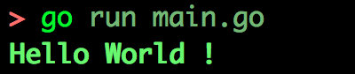

# Golang package shellcolors

[](https://goreportcard.com/report/github.com/chtison/libgo)
[](https://godoc.org/github.com/chtison/libgo/shellcolors)
[](https://travis-ci.org/chtison/libgo)

Package shellcolors is a simple interface for terminal Select Graphic Rendition (SGR).

## Install this package + the cli frontend of this package: [sc](cmd/sc)
```
$ go get -v github.com/chtison/libgo/shellcolors/...
```

## Documentation

Package shellcolors lets you modify style of you outputed text in a terminal
like the boldness or the background color.
However, some SGR codes might not be supported by your terminal.

https://en.wikipedia.org/wiki/ANSI_escape_code#graphics

```go
package main

import (
	"fmt"
	sc "github.com/chtison/libgo/shellcolors"
)

func main() {
	fmt.Println(fmt.Sprintf("%sHello World !%s",
		sc.New(sc.Bold, sc.Green),
		sc.New(sc.Reset),
	))
}
```

> fishshell iTerm2 osx

The type ShellColor implements the [fmt.Stringer](https://golang.org/pkg/fmt/#Stringer) interface.

#### There are 3 primary functions to handle ShellColor type:

```go
// Create a new ShellColor "object"
func New(codes ...CodeSGR) *ShellColor { }
// Add a parameter to the ShellColor "object"
func (self *ShellColor) Add(codes ...CodeSGR) *ShellColor { }
// Get back a string formatted for controlling terminal parameters
func (self *ShellColor) String() string { }
```

#### And functions designed for adding colors
```go
// Add font color 256 colors (not always supported)
func (self *ShellColor) Color(color uint8) *ShellColor { }
// Add background color 256 colors (not always supported)
func (self *ShellColor) BgColor(color uint8) *ShellColor { }
// Add font color (not always supported)
func (self *ShellColor) ColorRGB(red, green, blue uint8) *ShellColor { }
// Add background color RGB (not always supported)
func (self *ShellColor) BgColorRGB(red, green, blue uint8) *ShellColor { }

func NewWithColor(color uint8, codes ...CodeSGR) *ShellColor { }
func NewWithColorRGB(red, green, blue uint8, codes ...CodeSGR) *ShellColor { }
func NewWithBgColor(color uint8, codes ...CodeSGR) *ShellColor { }
func NewWithBgColorRGB(red, green, blue uint8, codes ...CodeSGR) *ShellColor { }
```
#### All codes SGR
```go
// First range of codeSGR
// Reset is the one which will reset any previous codeSGR
const (
	Reset CodeSGR = iota // Cancel all previous parameters
	Bold
	Faint
	Italic
	Underline
	BlinkSlow
	BlinkRapid
	Negative
	Conceal
	CrossedOut
)

// Second range of codeSGR
const (
	Fraktur CodeSGR = 20 + iota
	NoBold
	NoBoldAndFaint
	NoItalicAndFraktur
	NoUnderline
	NoBlink
	Reserved26
	NoNegative
	NoConceal
	NoCrossedOut
)

// Text color
const (
	Black CodeSGR = 30 + iota
	Red
	Green
	Yellow
	Blue
	Magenta
	Cyan
	White
	CustomColor // Use ShellColor.Color(:) or ShellColor.ColorRGB(:,:,:)
	DefaultColor
)

// Background color
const (
	BgBlack CodeSGR = 40 + iota
	BgRed
	BgGreen
	BgYellow
	BgBlue
	BgMagenta
	BgCyan
	BgWhite
	BgCustomColor // Use ShellColor.BgColor(:) or ShellColor.BgColorRGB(:,:,:)
	BgDefaultColor
)

// Text color high intensity
const (
	BlackHI CodeSGR = 90 + iota
	RedHI
	GreenHI
	YellowHI
	BlueHI
	MagentaHI
	CyanHI
	WhiteHI
)

// Background color high intensity
const (
	BgBlackHI CodeSGR = 100 + iota
	BgRedHI
	BgGreenHI
	BgYellowHI
	BgBlueHI
	BgMagentaHI
	BgCyanHI
	BgWhiteHI
)
```
