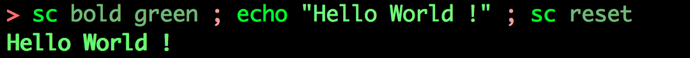

# Golang package sc

[](https://godoc.org/github.com/chtison/libgo/shellcolors/cmd/sc)
[](https://travis-ci.org/chtison/libgo)

Package sc is a command line interface for the package [shellcolors](..).

#### Install this command

```sh
$ go get -v github.com/chtison/libgo/shellcolors/cmd/sc
```

#### Examples



